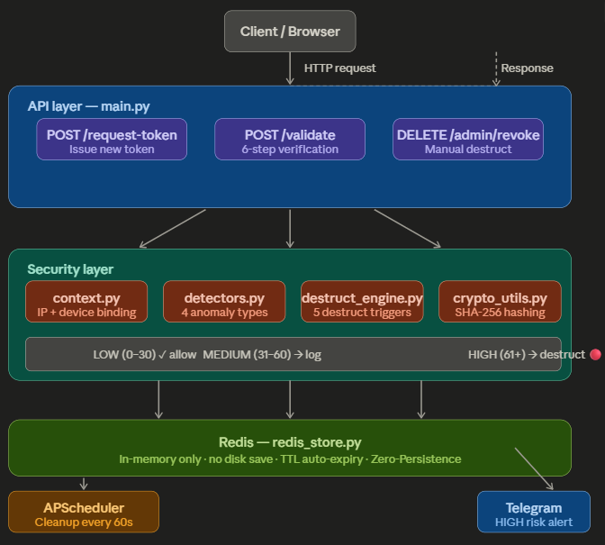

#  Zero-Persistence Self-Destructing Token System

> API 토큰 유출 시 수초 내 자동 무효화 보안 시스템

##  Results
- ✅ 41/41 Tests Passed (100%)
- ✅ Code Coverage: 81%
- ✅ 4 Anomaly Detectors
- ✅ 5 Auto-Destruct Triggers
- ✅ Telegram Security Alerts
- ✅ OWASP ZAP Security Scan Completed

##  Architecture


##  Quick Start
\```bash
# 1. Install dependencies
pip install -r requirements.txt

# 2. Start Redis
docker run -d --name my-redis -p 6379:6379 redis:alpine

# 3. Start server
uvicorn main:app --reload

# 4. Open dashboard
http://localhost:8000
\```

##  Tech Stack
- FastAPI · Redis · Docker · JWT · SHA-256 · APScheduler · Telegram

##  Security Features
- Zero-Persistence: tokens never saved to disk
- Context Binding: IP + User-Agent token locking
- 4 Anomaly Detectors: Replay, Velocity, Geo, Endpoint Enum
- 5 Auto-Destruct Triggers
- Real-time Telegram alerts on HIGH risk

##  Project Structure
- `main.py` — FastAPI entry point
- `token_engine.py` — Token logic
- `detectors.py` — 4 anomaly detectors
- `destruct_engine.py` — Auto-destruct system
- `alerting.py` — Telegram alerts
- `test_system.py` — 41 unit tests
- `load_test.py` — Load testing

##  OWASP ZAP Security Scan
- No critical vulnerabilities found
- 5 low/medium header-related findings
- SQL Injection: Not detected ✅
- XSS: Not detected ✅
- Authentication Bypass: Not detected ✅
